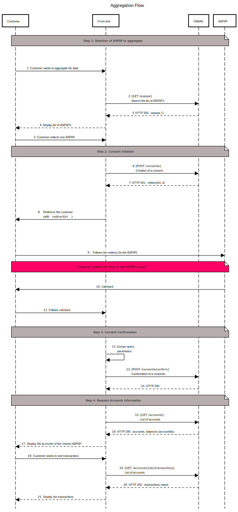

# Sopra Banking Software Open Banking Aggregation & Advanced Services Training

## Start the client

`npm i`  
`npm run serve`

## Goal

The goal of this training exercice is to created a front-end vue.js application that will consume the OBAAS back-end APIs to aggregate the accounts of a PSU.

Steps to complete:
- Fetch and display the list of ASPSPs available
- Let the PSU create consents to connect to ASPSPs
- Fetch and display the PSU's accounts
- Fetch and display the PSU's accounts' transactions
- Let the PSU delete his consents

## OBAAS API

### Auth

To access the API you will need to provide a bearer token in the authorization header of every HTTP call.

### Documentation

[See OpenAPI file](./doc/obaas-v1.openapi.yaml)

## AIS consent flow

